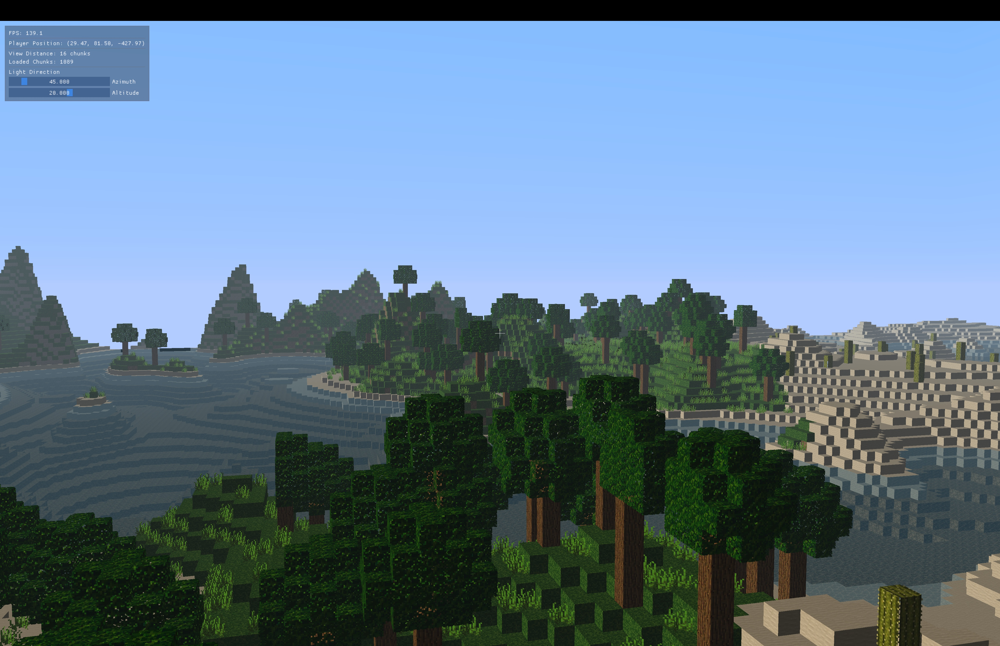

# Voxel Game Engine



Voxel Engine is a voxel-based game engine and renderer written in C++ using OpenGL

### Prerequisites

- CMake 3.2 or higher
- A C++20 compatible compiler
- Git

### Build Instructions

1. **Initialize submodules**:

    ```bash
    git submodule update --init --recursive
    ```

2. **Create a build directory** and navigate into it:

    ```bash
    mkdir build
    cd build
    ```

3. **Configure the project** using CMake:

  Mac & Linux:
    ```bash
    cmake ..
    ```
  Windows:
  ```bash
  cmake -DCMAKE_BUILD_TYPE=Release ..
  ```


4. **Build the project**:
  Mac & Linux:
  ```bash
  make
  ```
  Windows:
  ```bash
  cmake --build . --config=Release
  ```

### Running the Application

After building the execuatble, you can run the app from the build directory.
```bash
./game/bin/app
or
.\game\bin\app.exe
```
